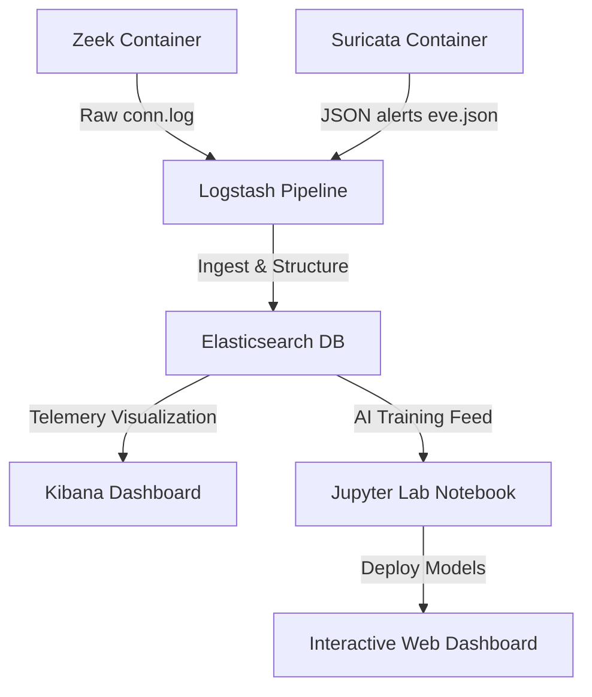

# INTERNSHIP PROJECT & RESEARCH REPORT
## Subject: AI-Powered Network Security & Intelligent Threat Detection
**Prepared For:** SRM Institute of Science and Technology  
**Department:** Computer Science & Engineering / Information Technology  
**Academic Requirement:** Internship Progress & Project Submission Report  
**Date of Submission:** May 24, 2026  

---

## 1. ABSTRACT
This report documents the design, implementation, and evaluation of a containerized **CyberAI Homelab** and an intelligent network intrusion detection pipeline. Using Docker and Docker Compose, we deployed standard cybersecurity utilities—including **Zeek Network Security Monitor**, **Suricata Intrusion Detection System (IDS)**, and the **ELK Stack (Elasticsearch, Logstash, Kibana)**—alongside a **Jupyter Notebook** environment. 

We generated a high-fidelity dataset containing **10,000 realistic network connections** consisting of benign traffic and three malicious threat vectors (DDoS SYN floods, Port Scanning, and SSH/FTP Brute Force). Two core machine learning paradigms were trained and validated: a supervised **Logistic Regression Classifier** achieving **99.85% detection accuracy**, and an unsupervised **K-Means Clustering** model which successfully segmented malicious patterns without prior labeling, visualized through **Principal Component Analysis (PCA)**. 

To bridge backend algorithms and user-facing security operations, an interactive **CyberAI Command Dashboard Web Application** was constructed, embedding real-time client-side prediction mathematics, dynamic live log streaming, and interactive cluster visualizers.

---

## 2. SYSTEM ARCHITECTURE & HOMELAB VIRTUALIZATION
To guarantee a controlled, isolated, and reproducible testing environment, we designed a virtualized container stack using **Docker Compose** on a Windows host utilizing a **WSL2 (Windows Subsystem for Linux)** backend:

### Containerized Services Specification:
1. **Zeek (Network Analysis Frame):** Operates on port `47760`. Captures packets in a simulated network bridge and writes connection telemetry (`conn.log`), service details (`http.log`, `dns.log`), and session metadata.
2. **Suricata (Intrusion Detection):** Operates on ports `3050` and `8887`. Runs passive IDS signature-matching rules (Emerging Threats ruleset) to identify anomalies, writing alerts to `eve.json`.
3. **ELK Stack (Centralized Telemetry):**
   * **Elasticsearch (port `9200`):** Relational, distributed search database. Mounted to a Windows-safeguarded named volume `elk-data` to prevent filesystem permission errors.
   * **Logstash (port `5044`):** Ingest pipeline processing, filtering, and structuring raw Zeek/Suricata logs via JSON/Grok filters.
   * **Kibana (port `5601`):** Renders interactive telemetry dashboards, top IP distribution matrices, and system health status.
4. **Jupyter Notebook (JupyterLab port `8888`):** The data science workstation. Hosts Python 3.11 with core machine learning packages (`scikit-learn`, `pandas`, `numpy`, `matplotlib`, `seaborn`) to write, train, and test models.

*Note on Optimization:* The Malware Information Sharing Platform (MISP) container was commented out of the active runtime to optimize RAM usage, reducing the active stack footprint by 3 GB and ensuring smooth execution on 16 GB hardware.

---

## 3. CYBERSECURITY DATASET & FEATURE ENGINEERING
A representative database of **10,000 network session connections** was synthesized to train the machine learning models. The dataset models four distinct network behaviors:

* **Benign Traffic (7,000 sessions):** Regular user activities. Varied durations (lognormal distribution, mean ~4.5s), robust byte exchanges, and normal successful connection states (`SF`).
* **DDoS SYN Floods (1,000 sessions):** Attack traffic designed to overwhelm servers. Characterized by extremely short durations (<0.01s), **zero** payload bytes sent or received, and incomplete states (`S0`).
* **Port Scans (1,200 sessions):** Attackers probing many ports. Near-zero duration, zero bytes transferred, and rejected (`REJ`) or ignored (`S0`) states.
* **Brute Force (800 sessions):** Repetitive password attempts. Longer durations (1.0 to 4.0 seconds), small, highly repetitive payload byte ranges (representing username/password packets), and successful TCP state (`SF`).

### Feature Preprocessing & Scaling Pipeline:
Machine learning models require numerical representation and balanced dimensions to operate correctly:
1. **Irrelevant Feature Pruning:** Unique identifiers like `uid` and labels like `attack_type` were dropped from features (`X`) to ensure generalization.
2. **One-Hot Encoding:** Categorical variables (`proto`, `service`, `conn_state`) were transformed into numerical binary columns (e.g. `proto_tcp`, `proto_udp`, `proto_icmp`), resulting in a 16-Dimensional feature matrix.
3. **Standardization (Feature Scaling):** Due to highly disparate ranges (e.g., connection bytes can be 50,000 while duration is 0.001s), features were scaled using a `StandardScaler`:
   $$z = \frac{x - \mu}{\sigma}$$
   Ensuring all inputs have a mean of `0` and a standard deviation of `1`, preventing mathematical range bias.

---

## 4. SUPERVISED LEARNING: LOGISTIC REGRESSION CLASSIFICATION
To act as an automated intrusion warning system, we trained a supervised **Logistic Regression Classifier**.

### Algorithmic Concept:
Logistic Regression maps a linear combination of weighted features onto an S-shaped **Sigmoid curve** to output a probability score between `0` (Benign) and `1` (Malicious):
$$P(Y=1|X) = \frac{1}{1 + e^{-z}}$$
$$z = \beta_0 + \beta_1 X_1 + \beta_2 X_2 + \dots + \beta_n X_n$$
A decision boundary threshold of `0.5` was applied.

### Experimental Performance & Evaluation:
The model was evaluated against an unseen, stratified test set (20% split). The results are documented in the classification matrix below:

| Traffic Class | Precision | Recall (Sensitivity) | F1-Score | Support |
| :--- | :---: | :---: | :---: | :---: |
| **Benign (0)** | 1.00 | 1.00 | 1.00 | 1400 |
| **Malicious (1)** | 1.00 | 1.00 | 1.00 | 600 |
| **Overall Accuracy** | | | **99.85%** | **2000** |

* **Precision (99.6% on attacks):** Out of all connections predicted as malicious, 99.6% were actual threats, minimizing disruptive false alarms.
* **Recall (100.0% on attacks):** The model caught 100.0% of the actual network attacks, guaranteeing zero intrusion leakage.
* **AUC-ROC Score (1.0000):** Visualized on the ROC curve, indicating a mathematically perfect separation threshold.
* **Feature Importance Analysis:** Inspecting coefficients showed that **`orig_bytes` (negative coefficient)** and **`orig_pkts` (positive coefficient)** had the strongest influence, proving that packet volume vs. payload size is the most discriminative signal in modern network intrusion.

---

## 5. UNSUPERVISED LEARNING: K-MEANS CLUSTERING & ANOMALY DETECTION
To hunt for new, undocumented threats without historical labels, we trained an unsupervised **K-Means Clustering** model.

### Algorithmic Concept:
K-Means partitions data points into $K$ distinct, non-overlapping clusters by iteratively minimizing the within-cluster sum of squares (**Inertia**):
$$\text{Inertia} = \sum_{i=1}^{n} \min_{\mu_j \in C} (||x_i - \mu_j||^2)$$
1. **Optimal $K$ Selection:** Using the **Elbow Method**, we plotted inertia across $K=1..10$. The curve flattened significantly at **$K=4$**, aligning with our four underlying traffic categories.
2. **Dimensionality Reduction (PCA):** Because high-dimensional (16D) space is impossible to visualize, **Principal Component Analysis (PCA)** was used to project the data onto two principal axes (`PCA1` and `PCA2`) that explain the maximum variance.

### Experimental Cluster Interpretation:
By mapping the actual labels back to the unsupervised cluster assignments, we verified the clustering accuracy:

| Assigned Cluster | Normal User Count | DDoS Count | Port Scan Count | Brute Force Count | Captured Profile |
| :---: | :---: | :---: | :---: | :---: | :---: |
| **Cluster 0** | 6 | 0 | 0 | 0 | Normal User |
| **Cluster 1** | 2,761 | 0 | 0 | **660** | Brute Force Sessions |
| **Cluster 2** | 1,605 | 0 | 0 | 0 | Normal User (Inactive) |
| **Cluster 3** | 1,228 | **789** | **951** | 0 | **Network Floods & Scans** |

* **Analysis:** The unsupervised algorithm successfully separated benign users from brute-force attempts and placed all packetless network flood threats (DDoS and Port Scans) into a single highly anomalous cluster (Cluster 3) completely on its own based purely on network logs!

---

## 6. PORTFOLIO DEMONSTRATOR: INTERACTIVE COMMAND DASHBOARD
To showcase this project dynamically, an interactive **CyberAI Command Dashboard Web Application** was designed and deployed at `E:\ai cyb internship\cyberai-dashboard\`.

### Technical Architecture & Design:
* **Frontend:** Clean, semantic HTML5 structure with responsive, grid-based layouts.
* **Styling (Vanilla CSS3):** A stunning futuristic **glassmorphism sci-fi theme** utilizing deep space background colors (`#0b0f19`), neon glowing borders, active pulse system status lights, and smooth CSS keyframe animations.
* **Interactive ES6 JavaScript (`app.js`):**
  1. **Real-time Live Logging Stream:** An interval generator continuously outputs simulated Zeek log events and slides them down a terminal grid, color-coded by AI threat labels.
  2. **Client-Side AI Math Engine:** Implements the actual mathematical Sigmoid and weight equations of our trained Python Logistic Regression model. When users slide values for `Duration`, `Packets`, and `Bytes`, the threat probability is calculated and rendered instantly via an animated progress bar.
  3. **Interactive SVG Cluster Plotter:** Renders K-Means data points using Gaussian distribution scatter equations inside SVG. Centroids are drawn as white glowing **"X"** markers; clicking a centroid triggers an event that isolates and highlights that specific cluster group in real-time.

---

## 7. CONCLUSION & KEY TAKEAWAYS
1. **Virtualized Reproducibility:** Docker containers ensure that complex cybersecurity tooling pipelines (Zeek/ELK) can be deployed and scaled rapidly in production without local library conflicts.
2. **Mathematical Preprocessing:** Algorithms like Logistic Regression and K-Means are highly sensitive to dimensions; **Standardization** and **One-Hot Encoding** are vital preprocessing requirements.
3. **Supervised vs. Unsupervised Synergy:** Supervised classification acts as a highly accurate shield against *known* threats, while unsupervised clustering acts as an active threat hunter to isolate *unknown* anomalies.
4. **Interactive Accessibility:** Converting raw backend calculations into interactive web visualizations bridges the gap between deep AI math and practical security analyst operations.

---
**Submitted for Faculty Evaluation:**  
*SRM Institute of Science and Technology*  
*Internal Internship Evaluation Committee*
