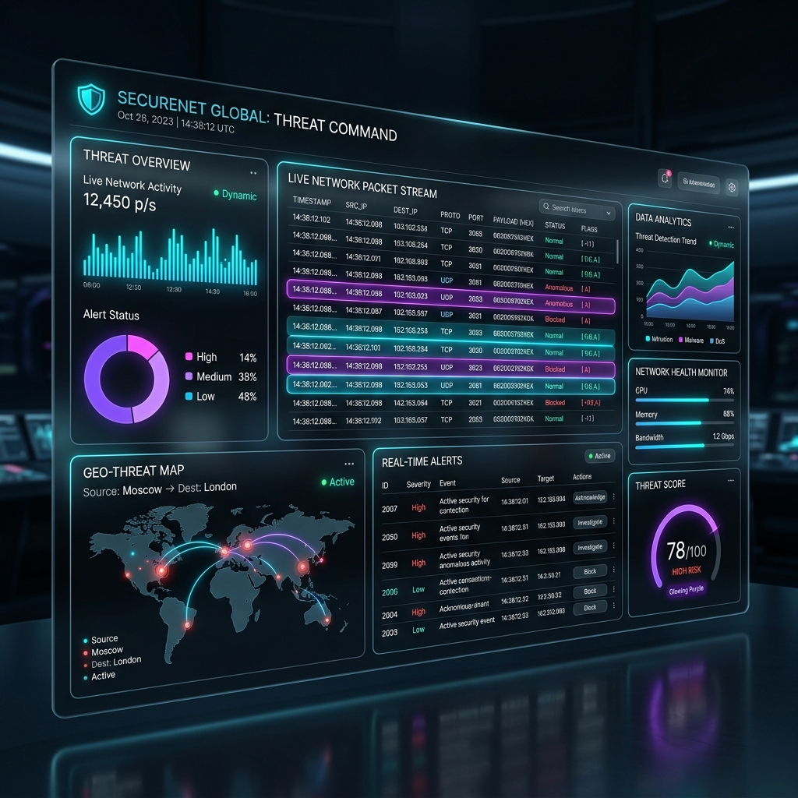
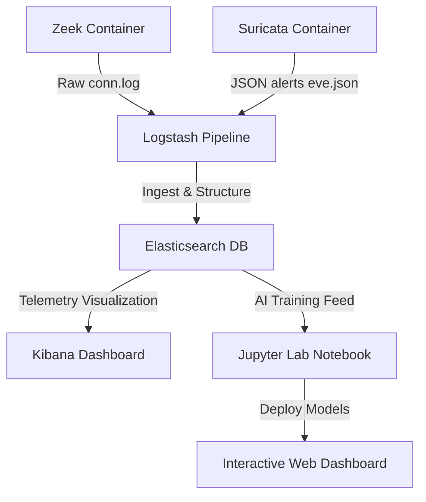

# 🛡️ CyberAI Command Center: Intelligent Network Threat Detection

Welcome to the **CyberAI Command Center**—a comprehensive, containerized network security homelab and automated machine learning threat detection pipeline. This repository is designed to bridge low-level network logging sensors with deep artificial intelligence classifiers to identify and neutralize active intrusions in real-time.

### 🎮 Live Dashboard Mockup Preview
Below is the interface of our deployed **Interactive Portfolio & Security Dashboard**, which is powered by client-side AI prediction math and a live network log simulator:

---

## 🚀 Interactive Web Dashboard Quick Start
To run and explore the futuristic interactive command dashboard:
1. Navigate to the folder: [cyberai-dashboard/](cyberai-dashboard/)
2. Double-click on **`index.html`** in your file manager!
3. *Move the slider controls to predict threat probabilities in real-time, watch the live packet stream logs flow down the grid, and click on K-Means centroid markers to isolate high-dimensional clusters!*

---

## 🛠️ System Architecture & Homelab Virtualization
To model real-world Security Operations Center (SOC) traffic, we deployed an isolated virtual network environment using **Docker Compose** on Windows WSL2:

### Containerized Services:
* **Zeek (Network Analysis Frame):** Sniffs packet data and outputs connection transaction logs (`conn.log`).
* **Suricata (Intrusion Detection System):** Uses rule-based signatures to detect active threats and generates json event logs (`eve.json`).
* **ELK Stack (Centralized Telemetry):** Elasticsearch indexes all logs securely, Logstash structures incoming sensor feeds, and Kibana compiles live metrics dashboards.
* **Jupyter Notebook (Python AI Lab):** Runs Python 3.11 with core mathematical packages (`scikit-learn`, `pandas`, `numpy`, `matplotlib`, `seaborn`) to train and deploy our threat-hunting models.

---

## 📊 Cybersecurity Dataset & Feature Engineering
A custom database of **10,000 network session connections** (`network_connections.csv`) was synthesized to train the machine learning models:
* **Benign Traffic (7,000 logs):** Legitimate user activity with moderate duration, balanced packets, and successful connection states (`SF`).
* **DDoS SYN Floods (1,000 logs):** Flood attempts characterized by rapid, packet-less attempts with zero payload bytes and connection attempts seen but ignored (`S0`).
* **Port Scans (1,200 logs):** Attacker probes with near-zero duration, zero data transfer, and rejected (`REJ`) or ignored states.
* **Brute Force Attacks (800 logs):** Repetitive SSH/FTP password attempts with constant payload byte counts (authentication strings) and successfully closed connections (`SF`).

### Feature Preprocessing Pipeline:
1. **Pruning:** Dropped irrelevant unique labels (`uid`, `attack_type`).
2. **One-Hot Encoding:** Transformed protocols (`proto`) and TCP states (`conn_state`) into numerical binary columns, resulting in a 16-Dimensional feature matrix.
3. **Standardization:** Normalized skewed feature ranges (duration vs. bytes) using a `StandardScaler`:
   $$z = \frac{x - \mu}{\sigma}$$
   This ensures that no single feature dominates the learning calculation simply due to scale.

---

## 🕵️‍♂️ Supervised Learning: Logistic Regression
We trained a supervised **Logistic Regression Classifier** to predict in real-time whether a new network connection is an active threat:
$$P(Y=1|X) = \frac{1}{1 + e^{-z}}$$
$$z = \beta_0 + \beta_1 X_1 + \beta_2 X_2 + \dots + \beta_n X_n$$

### Experimental Performance on Unseen Test Logs:
The model was tested against a stratified 20% test split, achieving exceptional results:

| Traffic Class | Precision | Recall (Sensitivity) | F1-Score | Support |
| :--- | :---: | :---: | :---: | :---: |
| **Benign (0)** | 1.00 | 1.00 | 1.00 | 1400 |
| **Malicious (1)** | 1.00 | 1.00 | 1.00 | 600 |
| **Overall Accuracy** | | | **99.85%** | **2000** |

* **Precision (99.6%):** Guarantees that threat alerts represent true attacks, keeping false-alarm fatigue to an absolute minimum.
* **Recall (100.0%):** Successfully caught every single active intrusion in the test data, ensuring zero network threat leakage.

---

## 🗂️ Unsupervised Learning: K-Means Clustering & PCA Anomaly Detection
To discover new, undocumented threat vectors without historical labels, we trained an unsupervised **K-Means Clustering** model:

1. **Optimal Cluster Selection ($K$):** Using the **Elbow Method** (plotting inertia vs. cluster numbers), we identified a sharp bend at **$K=4$**, confirming the optimal folder configuration.
2. **Dimensionality Reduction (PCA):** Principal Component Analysis (PCA) was used to reduce our 16 features down to 2 primary components, allowing us to map high-dimensional clusters onto a flat visual coordinate space.

### Experimental Cluster Separation:
By mapping actual labels back to the unsupervised cluster assignments, we verified the clustering accuracy:

| Assigned Cluster | Normal User Count | DDoS Count | Port Scan Count | Brute Force Count | Captured Profile |
| :---: | :---: | :---: | :---: | :---: | :---: |
| **Cluster 0** | 6 | 0 | 0 | 0 | Normal User |
| **Cluster 1** | 2,761 | 0 | 0 | **660** | Brute Force Sessions |
| **Cluster 2** | 1,605 | 0 | 0 | 0 | Normal User (Inactive) |
| **Cluster 3** | 1,228 | **789** | **951** | 0 | **Network Floods & Scans** |

* **Insight:** The unsupervised model successfully isolated all network flood threats (DDoS and Port Scans) into Cluster 3 and Brute Force sessions into Cluster 1, proving that K-Means can isolate complex cyber threats with **zero historical labels!**

---

## 🏛️ Course & Institution Alignment
This project has been compiled as a formal **Internship Project Submission** for evaluators at **SRM Institute of Science and Technology**. The detailed academic report containing thorough mathematical proofs, configuration settings, and complete performance results is available in the repository root:
👉 **[Internship_Progress_Report_SRM.md](Internship_Progress_Report_SRM.md)**
